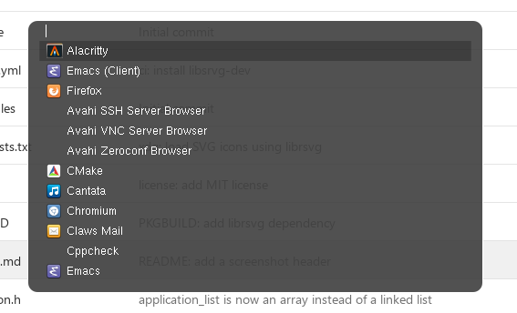

[](https://ci.codeberg.org/dnkl/fuzzel)

# Fuzzel

Fuzzel is a Wayland-native application launcher and fuzzy finder, inspired by rofi and dmenu.

[](https://repology.org/project/fuzzel/versions)


## Screenshot



_Fuzzel, with transparency, on top of a browser window showing a diff of a fuzzel commit_


## Features

### For app launching

- Fuzzy-find applications from a list and launch them
- Icon support
- Remembers frequently launched applications
- Customize which `.desktop` files are searched
- Option to filter apps based on `OnlyShowIn` and `NotShowIn`
- Startup notification support
- Launch prefix option to customize how apps are launched
- Display a large icon of current selection if there are only a few
  matches
- Option to display executables in $PATH
- Option to execute the input rather than return an app
- Support for localized strings

### For dmenu mode

- dmenu mode where newline separated entries are read from STDIN
- Support for Rofi's protocol to support icons
- Optional cache with custom path
- Password mode
- Prompt-only mode
- Exact-match option to support multi-stage menus
- Option to return index of what's selected rather than what's selected
- Some dmenu option compatibility. Invoking it as `dmenu` enables dmenu mode
- Option for null-separated input

### For all modes

- Numerous customizable key bindings, based on Emacs
- Mouse & touchscreen support
- Paste support
- Emoji support
- A number of theming options, which can be set in a separate `include` file
- fzf-style matching with ability to filter huge lists
- Optimized for performance
- Zsh and Fish completions
- Support for true fractional scaling
- Wayland native

For details, see [`man fuzzel`](./doc/fuzzel.1.scd) and [`man fuzzel.ini`](./doc/fuzzel.ini.5.scd)

## Requirements

### Runtime

* pixman
* wayland (_client_ and _cursor_ libraries)
* xkbcommon
* cairo (optional, required by librsvg)
* libpng (optional)
* librsvg (optional, for enhanced SVG icon support)
* [fcft](https://codeberg.org/dnkl/fcft) [^1]

Fuzzel uses the builtin nanosvg backend to render SVG icons by
default. Since nanosvg is somewhat limited, we also offer a librsvg
backend for SVG icons. Note that librsvg also requires cairo.

[^1]: can also be built as subprojects, in which case they are
    statically linked.


### Building

* meson
* ninja
* wayland protocols
* scdoc
* [tllist](https://codeberg.org/dnkl/tllist) [^1]


## Installation

To build, first, create a build directory, and switch to it:
```sh
mkdir -p bld/release && cd bld/release
```

Second, configure the build (if you intend to install it globally, you
might also want `--prefix=/usr`):
```sh
meson --buildtype=release \
    -Denable-cairo=disabled|enabled|auto \
    -Dpng-backend=none|libpng \
    -Dsvg-backend=none|librsvg|nanosvg \
    ../..
```

`-D{png,svg}-backend` can be used to force-enable or force-disable a
specific png and/or svg backend. Note that _nanosvg_ is builtin
(i.e. it needs to external dependencies).

`-Denable-cairo` can be used to force-enable or force-disable cairo
support. When disabled, fuzzel will not be able to draw rounded
corners, nor will it support SVGs using the _librsvg_ backend.

Three, build it:
```sh
ninja
```

You can now run it directly from the build directory:
```sh
./fuzzel
```

Use command line arguments to configure the look-and-feel:
```sh
./fuzzel --help
```

Optionally, install it:
```sh
ninja install
```

For more detailed configuration information, see the man pages:
```sh
man fuzzel
man fuzzel.ini
```
## Testing

Fuzzel has some automated tests in `test/`. To run them, Fish shell and `wtype` are required.
The test runner can be installed within Fish shell with:

    fisher install jorgebucaran/fishtape

Once installed, the tests can be run with:

    fishtape test/*.fish

## License

Fuzzel is released under the [MIT license](LICENSE).

Fuzzel uses nanosvg, released under the [Zlib
license](3rd-party/nanosvg/LICENSE.txt).


# Sponsoring/donations

* Liberapay: https://liberapay.com/dnkl
* GitHub Sponsors: https://github.com/sponsors/dnkl

[](https://liberapay.com/dnkl/donate)
